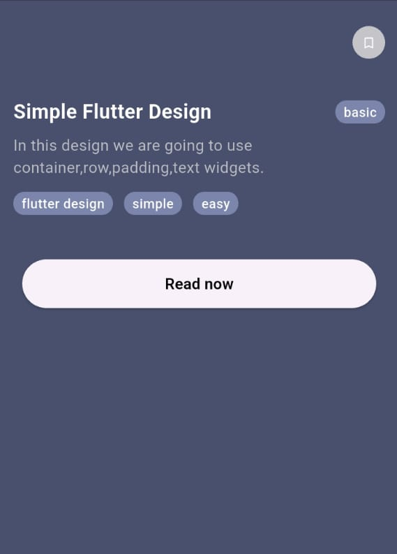
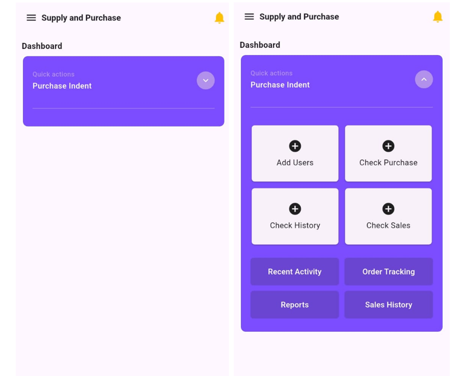

# Flutter UI Designs

A collection of mini Flutter projects showcasing different UI layouts and components.  
This repository is meant for learning, practicing, and showcasing Flutter UI design skills.  

---

## 📸 Screenshots & Code Links

### 🔑 Info Card
Information page with buttons,text.



👉 [View Code](lib/screens/info_card.dart)

---

### 👤 Profile Card
Profile card layout with image, name, and details.


👉 [View Code](lib/screens/profile_card.dart)

---

### 🖥️ Dashboard UI
A simple dashboard with icons and cards.



👉 [View Code](lib/screens/dash_board.dart)

---

## 🛠 Tech Stack
- Flutter (Dart)  
- Material Design Components  
- Widgets: `ListView`, `GridView`, `Column`, `Row`, `Card`, `ClipRRect`, etc.  

---

## 🚀 Getting Started
To run this project locally:  

```bash
# Clone the repo
git clone https://github.com/your-username/flutter_ui_designs.git

# Navigate to folder
cd flutter_ui_designs

# Get dependencies
flutter pub get

# Run the app
flutter run

